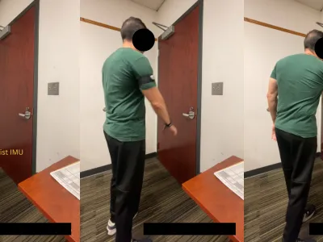



Below is a curated list of datasets developed by the **Cyber Identity & Behavior Research (CIBeR) Lab** at the University of South Florida.  
---

## 🗂️ Available Datasets

### **GestDoor: IMU-Based Door Entry Biometric Dataset**

**Description:**  
GestDoor contains wearable sensor data collected during **door-opening interactions** to support research in **motion-based authentication, behavioral biometrics, and gesture recognition**. Using **two 6-DOF IMUs** (wrist + upper arm), **11 participants** performed four task types across up to three sessions, producing **3,330 segmented samples** of accelerometer and gyroscope data sampled at **100 Hz**.

**Includes:**  
- 6-axis acceleration + angular velocity (+ quaternions, timestamps)  
- Four door-opening labels: `L_PUSH`, `L_PULL`, `R_PUSH`, `R_PULL`  
- Participant/session metadata (age, sex, height, dominant hand, session count)  
- Fully *segmented* samples — **no preprocessing required**

**Suggested Uses:**  
- Motion-based authentication  
- Smartwatch and wearable security research  
- Gesture and activity recognition  
- Biometric permanence and cross-session analysis  
- Behavioral signal modeling  
- Sensor fusion experimentation

**Usage Notes:**  
- Files provided in **`.csv`** format  
- Load using Python (`numpy`, `pandas`) or MATLAB  
- Suitable for ML models (SVM, RF, KNN), signal-distance approaches (DTW), or feature pipelines  
- Supports **intra-session** and **cross-session** evaluation protocols

**Citation:**  
> M. Ebraheem and T. Neal, "GestDoor: Gesture-Based User Authentication for Door Entries Utilizing Wearable IMUs," *2025 IEEE 19th International Conference on Automatic Face and Gesture Recognition (FG)*, Tampa/Clearwater, FL, USA, 2025, pp. 1-8, doi: 10.1109/FG61629.2025.11099107.

---

### **Mobile Keystroke Dynamics Dataset**

**Description:**  
Behavioral biometrics dataset of mobile keystrokes collected across sessions to evaluate long-term consistency and variation in typing behavior.

**Includes:**  
- Mobile fixed-text entry  
- Free-text chat samples  
- Timing gaps, key duration, error rates

**Use Cases:** behavioral biometrics, deception detection, authentication research

---

### **Cybersecurity Beliefs & Risk Behavior Survey Dataset**

**Description:**  
Mixed-methods dataset examining human reasoning behind cybersecurity decisions, including risk perception, password habits, and mental models of identity.

**Includes:**  
- Survey responses  
- Interview data  
- Behavior scenarios  
- Demographic metadata

**Use Cases:** usable security, risk communication, identity management design

---

## 📥 Requesting Access or Citing
You may contact **Dr. Tempestt Neal** for dataset access, as necessary, or collaboration inquiries.  
When using CIBeR datasets, please include the appropriate citations.

---

