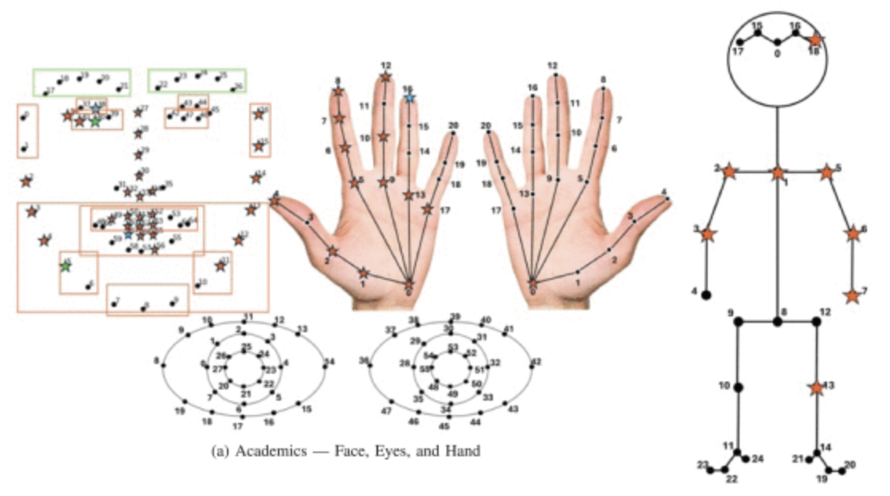



Below is a curated list of datasets developed by the **Cyber Identity & Behavior Research (CIBeR) Lab** at the University of South Florida.  
---

## 🗂️ Available Datasets

### **GestDoor: IMU-Based Door Entry Biometric Dataset**

**Description:**  
GestDoor contains wearable sensor data collected during **door-opening interactions** to support research in **motion-based authentication, behavioral biometrics, and gesture recognition**. Using **two 6-DOF IMUs** (wrist + upper arm), **11 participants** performed four task types across up to three sessions, producing **3,330 segmented samples** of accelerometer and gyroscope data sampled at **100 Hz**.

**Includes:**  
- 6-axis acceleration + angular velocity (+ quaternions, timestamps)  
- Four door-opening labels: `L_PUSH`, `L_PULL`, `R_PUSH`, `R_PULL`  
- Participant/session metadata (age, sex, height, dominant hand, session count)  
- Fully *segmented* samples — **no preprocessing required**

**Suggested Uses:**  
- Motion-based authentication  
- Smartwatch and wearable security research  
- Gesture and activity recognition  
- Biometric permanence and cross-session analysis  
- Behavioral signal modeling  
- Sensor fusion experimentation

**Usage Notes:**  
- Files provided in **`.csv`** format  
- Load using Python (`numpy`, `pandas`) or MATLAB  
- Suitable for ML models (SVM, RF, KNN), signal-distance approaches (DTW), or feature pipelines  
- Supports **intra-session** and **cross-session** evaluation protocols

**Citation:**  
> M. Ebraheem and T. Neal, "GestDoor: Gesture-Based User Authentication for Door Entries Utilizing Wearable IMUs," *2025 IEEE 19th International Conference on Automatic Face and Gesture Recognition (FG)*, Tampa/Clearwater, FL, USA, 2025, pp. 1-8, doi: 10.1109/FG61629.2025.11099107.

---

### **CD3: Cross-Domain Deception Dataset**

**Description:**  
The **Cross-Domain Deception Dataset (CD3)** contains **frame-level visual features** extracted from interview video recordings to support research in **deception detection through facial expressions, action units, gaze, and body/hand gestures**. Using a commercial laptop and Microsoft Teams, **45 participants** completed mock interviews across two sessions, responding to questions about biography, academic success, and well-being.  
The dataset provides **1,270 truthful** and **587 deceptive** clips, enabling cross-domain analysis of **how deception appears differently across content areas** and supporting research into **well-being–specific deception models**.

**Includes (983 frame-level features per sample):**
- **Gaze:** 8 gaze features (direction vectors + angles)
- **Landmarks:**  
  - 136 × 2D facial landmarks  
  - 204 × 3D facial landmarks  
  - 112 × 2D eye landmarks  
  - 168 × 3D eye landmarks  
  - 140 × 2D face keypoints  
- **Head Pose:** translation (x,y,z), rotation (pitch, yaw, roll)
- **Face Shape:** 40 PCA-based shape parameters  
- **Facial Action Units:** 35 total (18 presence, 17 intensity)
- **Body & Hands:**  
  - 50 body keypoints (2D)  
  - 84 hand keypoints (2D)  
- **Labels & Identifiers:** deception label (`1 = deceptive`, `0 = truthful`), participant ID (`PXXX`)

**File Format:**  
- Provided in **`.csv`** format  
- Each row represents **one video frame** from a participant response

**Suggested Uses:**  
- Deception detection (cross-domain + well-being–specific)  
- Action unit and gaze–based behavioral modeling  
- Gesture and micro-expression analysis  
- Domain adaptation and cross-domain inference  
- Multimodal vision features for cognitive state estimation  
- Representation learning for social/behavioral computing

**Educational & Research Use:**  
Available for coursework, capstone projects, theses, and experimentation in **deception detection, behavioral modeling, and multimodal machine learning**.

**Citation:**  
> S. L. King and T. Neal, "Exploring Vision-Based Features for Detecting Deception in Well-Being: A Cross-Domain Comparison," **2025 IEEE 19th International Conference on Automatic Face and Gesture Recognition (FG)**, Tampa/Clearwater, FL, USA, 2025, pp. 1-10, doi: 10.1109/FG61629.2025.11099290.

---

## 📥 Requesting Access or Citing
You may contact **Dr. Tempestt Neal** for dataset access, as necessary, or collaboration inquiries.  
When using CIBeR datasets, please include the appropriate citations.

---

