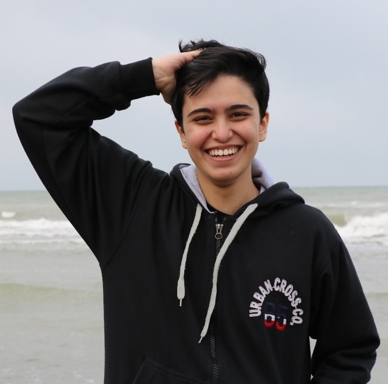
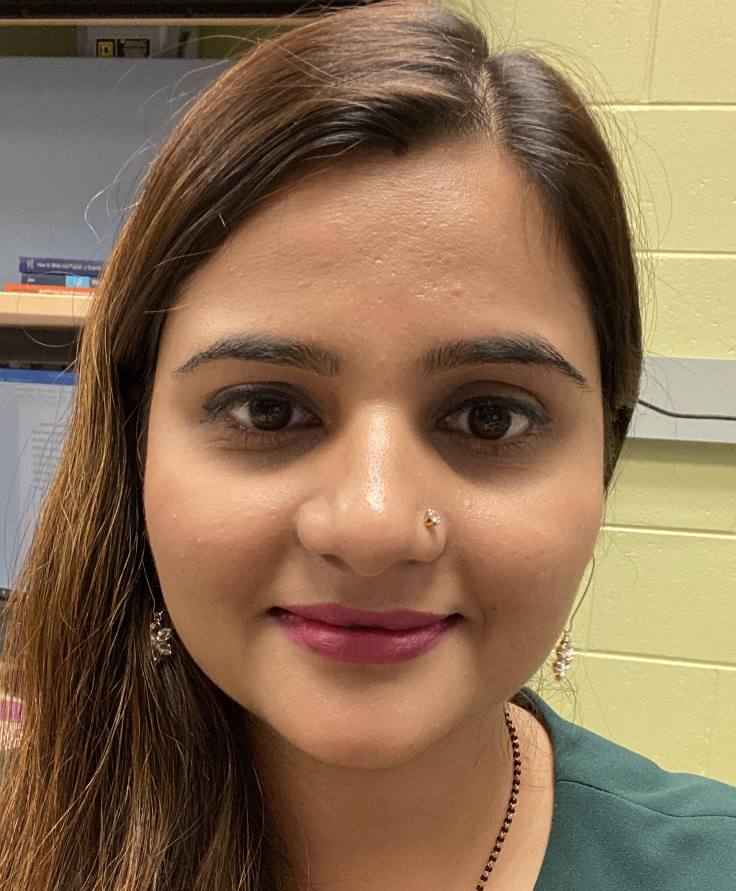



The Cyber Identity and Behavior Research (CIBeR) Lab primarily uses applied artificial intelligence and human-centered computing techniques to explore:
- Usable and inclusive cybersecurity systems for personally-owned computing devices, with a particular focus on identity and access management
- Interdisciplinary applications of human behavior analysis through smart sensing

## The CIBeR Group

  

    
    
Hoorad Abootalebi Ph.D. Student

  

  

    
    
Meghna Chaudhary Ph.D. Candidate

  

  

    
    
Caption for Image 3

  

  

    
    
Caption for Image 4

  

## Joining the Lab

### Open Positions
Currently, we do not have funding for additional Ph.D. students and can only welcome you if you have a fellowship.

### Interested Ph.D. Students
Ph.D. students with experience in one or more of the following research areas are encouraged to send their application materials (listed below) to Dr. Neal via e-mail.

- Machine and deep learning / pattern recognition systems
- Statistical analysis
- Image processing / computer vision
- Qualitative data analysis methods
- Natural language processing
- Proficiency in Python, TensorFlow, Keras, Sci-kit Learn
- Cloud storage
- Data mining

Ph.D students must be able and willing to:
- Support undergraduate students and serve as mentors
- Work toward effective communication of their research (e.g., presentation and writing skills)
- Work peacefully and productively in a team environment
  
Interested Ph.D. students should submit the following materials via e-mail for consideration.
- A brief summary of two projects (can be coursework or something you have completed on a job or your own) that you are most proud of, and what your contributions were to the project.
- Your views on the on-going research in the CIBeR lab that appeals to you the most. This requires that you familiarize yourself with our research projects. I'd like your input on our current research strategies, and how you feel you might be able to expand or contribute to these efforts.
- List of courses taken with final grades.
- Degree you are currently pursuing and expected start date at USF.
- Updated CV and publications, presentation slides, etc, if available.
- Link to personal website.

### Interested Masters Students
M.S. students seeking a thesis advisor are encouraged to reach out to Dr. Neal no later than the middle of their first semester in the M.S. program.
  
### Interested Undergraduate Students
We are always looking for enthusiastic undergraduate students interested in gaining hands-on experience in research. Ideal students will have some experience in our research areas and will be able to clearly articulate how they want to contribute to the lab. Ideal students will also be able to dedicate 3-5 hours to working with our research team per week, and will meet regularly during lab meetings. All undergraduate students are brought into the lab as volunteers, and are encouraged to take full advantage of the wide spectrum of learning opportunities. Importantly, all undergraduates working with the lab should strongly considering registering for Supervised Research (CIS 4915) credits.


  

