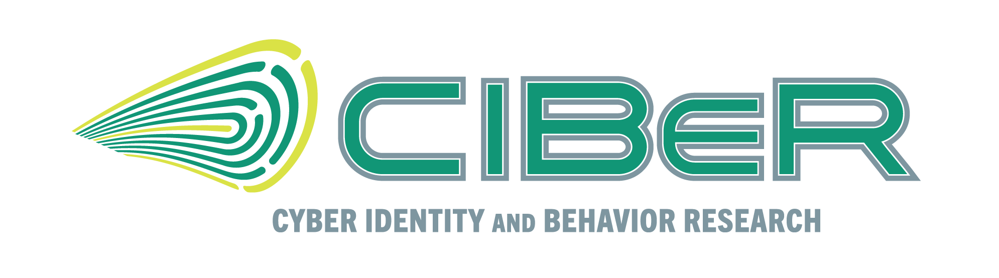



    

---

## Our Research Focus

I direct the **Cyber Identity & Behavior Research (CIBeR) Lab** at the University of South Florida.  
We study what it means for technology to *“know”* us—our **identity, behavior, and intentions**—and how to design systems that use that knowledge responsibly.

Our work naturally spans multiple fields (e.g., mental health, defense, medicine, education, cybersecurity) and requires collaborative partnerships.  
We care most about **why people behave the way they do in a digital world** and how those behaviors reflect *trust, risk, and decision-making*.

> When someone gives a child a smartphone, we ask *why* and whether they understand the potential risks.  
> When someone writes passwords on paper, we ask *why* and how we might teach cybersecurity in ways that fit real life.  
> **The technology matters — but the *human reasons* behind actions matter more.**

Across domains—mental health and well-being, generative AI (e.g., ChatGPT), biometric and identity systems, and cybersecurity systems—our goal is always the same:

> **to understand human–AI interaction and use that understanding to guide the design of systems that people can trust, use, and live with.**

---

## How We Do This

We combine **biometric intelligence**, **machine learning**, and **qualitative inquiry** to understand human behavior in digital and intelligent systems.

- We collect signals from everyday devices (phones, smartwatches, keyboards, IMUs).
- We pair sensing with interviews, surveys, focus groups, and user studies.
- We build and evaluate models when needed to reveal or test behavioral patterns.
- We run longitudinal studies to observe behavior over time and under evolving risks.
- We explore emerging and speculative AI systems to anticipate future challenges.

> **Our goal is not just to measure behavior or build systems —  
> but to *connect what technology detects with what people experience*.**

---

## Core Research Areas

Human–AI Interaction & Behavior

 
How people interpret, trust, adopt, or reject intelligent systems; what drives digital behaviors and decision-making  
*(e.g., interactions with generative models like ChatGPT, trust and explainability in AI tools)*

Cybersecurity & Identity Systems

 
Human-centered authentication, access, identity management, and usable security practices  
*(e.g., password habits, risk awareness in everyday security decisions)*

Biometric Intelligence & Multimodal Sensing

 
Behavioral and physiological signals as markers of identity, intent, or state  
*(e.g., keystrokes, gait, IMU motion, wearables for continuous authentication)*

Behavioral Signals in Digital Environments

 
How human behavior and choices reveal identity, deception, trust, or vulnerability online  
*(e.g., cyber decision-making, intent inference, deception in text or interaction patterns)*

User Perspectives on Emerging and Speculative Technologies

 
Anticipating expectations, concerns, and equity considerations before systems exist or scale  
*(e.g., future biometric infrastructures, defense applications, healthcare AI readiness, educational AI impacts)*

---

## Interested in Joining the CIBeR Lab?

> _Current funding is limited; we can only welcome new members with external fellowships._

<strong>Interested Ph.D. Students</strong>

 

Ph.D. students with experience in one or more of the following are encouraged to email Dr. Neal (include materials below):

- Machine/deep learning, pattern recognition
- Statistical analysis
- Image processing / computer vision
- Qualitative data analysis methods
- NLP
- Python, TensorFlow, Keras, Sci-kit Learn
- Cloud storage
- Data mining

Ph.D. expectations:
- Mentor undergraduate students
- Communicate research effectively
- Work collaboratively and productively

Email materials:
1. Summary of two projects & your contributions  
2. Your perspective on CIBeR lab work & how you'd expand it  
3. Coursework + final grades  
4. Degree + expected start date at USF  
5. Updated CV + publications/slides if available  
6. **Link to personal website**

<strong>Interested Master's Students</strong>

 
M.S. students seeking a thesis advisor should reach out no later than **mid-first semester**.

<strong>Interested Undergraduate Students</strong>

 

To join the lab, undergraduates should enroll in one of the following to gain structured research experience:

- **Independent Study (CIS 4900 / COP 4900)**
- **Supervised Research (CIS 4915)**

> **Plan ahead.** Scheduling must align with course registration timelines.

Funding is typically not available for undergraduates, but **students who continue into graduate research often secure long-term assistantships.**

