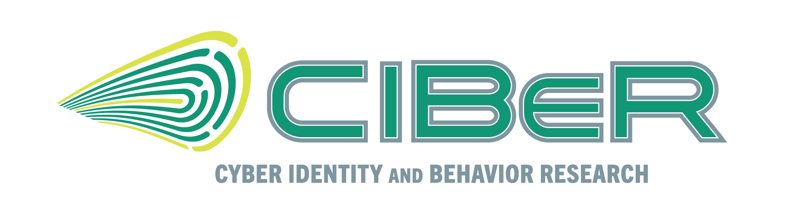

    



The **C**yber **I**dentity and **Be**havior **R**esearch (CIBeR) Lab is part of the [Department of Computer Science and Engineering](https://www.usf.edu/engineering/cse/) at the [University of South Florida](https://www.usf.edu/). The lab conducts research on applying AI, mobile device sensing, and human-centered computing to enhance the usability of cybersecurity systems and study human behavior in interdisciplinary contexts, such as mental health. Our research projects include:
> [Inclusive Cybersecurity Through the Lens of Accessible Identity and Access Management (I-CLAIM)](https://tempestt-neal.github.io/home/research/iclaim/)
> [Continuous User Authentication on Everyday Devices](https://tempestt-neal.github.io/home/research/continuousauthentication/)
> [Mobile Biometrics](https://tempestt-neal.github.io/home/research/mobilebiometrics/)

## **Current Students**
---

  

    
    
Hoorad Abootalebi Ph.D. Student

  

  

    
    
Meghna Chaudhary Ph.D. Candidate

  

  

    
    
Wilson Lozano Ph.D. Student

  

  

    
    
Sayde King   Ph.D. Candidate

  

  

    
    
Parush Gera Ph.D. Candidate

  

## **Joining the Lab**
---

### **Open Positions**
Currently, we do not have funding for additional Ph.D. students and can only welcome you if you have a fellowship.

### **Interested Ph.D. Students**
Ph.D. students with experience in one or more of the following research areas are encouraged to send their application materials (listed below) to Dr. Neal via e-mail.

- Machine and deep learning / pattern recognition systems
- Statistical analysis
- Image processing / computer vision
- Qualitative data analysis methods
- Natural language processing
- Proficiency in Python, TensorFlow, Keras, Sci-kit Learn
- Cloud storage
- Data mining

Ph.D students must be able and willing to:
- Support undergraduate students and serve as mentors
- Work toward effective communication of their research (e.g., presentation and writing skills)
- Work peacefully and productively in a team environment
  
Interested Ph.D. students should submit the following materials via e-mail for consideration.
- A brief summary of two projects (can be coursework or something you have completed on a job or your own) that you are most proud of, and what your contributions were to the project.
- Your views on the on-going research in the CIBeR lab that appeals to you the most. This requires that you familiarize yourself with our research projects. I'd like your input on our current research strategies, and how you feel you might be able to expand or contribute to these efforts.
- List of courses taken with final grades.
- Degree you are currently pursuing and expected start date at USF.
- Updated CV and publications, presentation slides, etc, if available.
- Link to personal website.

### **Interested Masters Students**
M.S. students seeking a thesis advisor are encouraged to reach out to Dr. Neal no later than the middle of their first semester in the M.S. program.
  
### **Interested Undergraduate Students**
If you are an undergraduate student interested in gaining hands-on research experience, you should **strongly** consider enrolling in one of the following courses to facilitate your involvement in our lab:

**For Computer Science and Computer Engineering Majors:**

- _[Contract Form for Independent Study (CIS 4900):](https://www.usf.edu/engineering/cse/undergraduate/dept-forms.aspx)_
This course allows students to work on a project in an area not typically covered by department courses. Independent Study can be used for elective credit but cannot substitute for required classes. To register, you must complete a contract with a supervising professor and have it approved by the Undergraduate Director or designee.

- _[Contract Form for Supervised Research (CIS 4915):](https://www.usf.edu/engineering/cse/undergraduate/dept-forms.aspx)_
This course provides an opportunity for supervised research experience for elective credit. You’ll need to establish a contract with your supervising professor and obtain approval from the Undergraduate Director or designee to register.

**For Information Technology and Cybersecurity Majors:**

- _[Contract Form for Independent Study (COP 4900):](https://www.usf.edu/engineering/cse/undergraduate/dept-forms.aspx)_
Similar to CIS 4900, this course is for projects outside of typical classroom courses and can count as an elective credit. A contract signed by the supervising professor and approved by the Undergraduate Director or designee is required.

### Important Considerations:

- _Plan Ahead:_ You must align with the university's course registration timeline. Schedule a meeting with me the semester before you wish to join the lab to discuss your interests and determine if enrolling in one of these courses is right for you. Requests made during the semester you wish to engage in the lab are harder to honor due to lab activity and potential disruptions.

- _Review Our Projects:_ Before reaching out, carefully review our ongoing projects to ensure they align with your interests. If they do not, I encourage you to seek opportunities better suited to your goals.

- _Funding:_ Please note that I typically do not offer funded assistantships to undergraduate students. However, participation in our lab has paved the way for long-term research assistantship opportunities for those who choose to pursue graduate studies with us.
