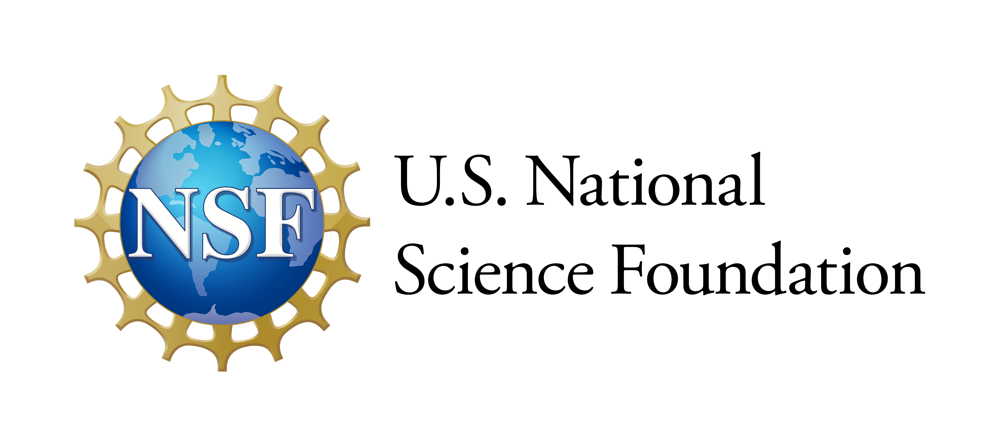

### Project Summary

The I-CLAIM project aims to increase cybersecurity awareness among Black/African American, Hispanic/Latino, American Indian/Alaska Native, and Native Hawaiian/Pacific Islander communities. These groups are historically underrepresented in Science and Engineering (S&E), leading to limited exposure to cybersecurity skills and technologies.

The focus is on Identity and Access Management (IAM), which regulates access to data and applications for legitimate users. Given the prevalence of IAM-related cyber attacks, this project seeks to develop inclusive user authentication systems (UASs) that cater to the needs of these groups. This involves understanding user perceptions, collecting diverse biometric data, and assessing the performance and bias of existing UASs to create novel, inclusive solutions.

Additionally, the project will develop inclusive cybersecurity education materials through participatory design workshops, ensuring accessibility and relevance for the targeted demographics. By doing so, I-CLAIM aims to enhance cybersecurity defenses and promote a sense of belonging in the cybersecurity domain.

### Funding

This project is funded by the U.S. National Science Foundation. 

### Publications

- [Placeholder for paper 1](#)
- [Placeholder for paper 2](#)

### Presentations

- [Placeholder for presentation 1](#)
- [Placeholder for presentation 2](#)

### Data

- [Placeholder for dataset 1](#)
- [Placeholder for dataset 2](#)
